<div align="center">

# 🕵️‍♂️ Financial Forensics Engine (FFE)

**Next-Generation, GPU-Accelerated Anti-Money Laundering (AML) & Graph Analysis Platform**

[](https://nextjs.org/)
[](https://www.typescriptlang.org/)
[](https://threejs.org/)
[](https://tailwindcss.com/)
[](https://opensource.org/licenses/MIT)

*Winner / Top Contender — RIFT 2026 Hackathon • Graph Theory & Financial Crime Track*

**[🔴 LIVE DEMO: Launch Interactive Engine](https://money-muling-engine-five.vercel.app)** *(Optimized for Desktop / Chromium Browsers)*

</div>

---

## ⚡ The FFE Advantage: Why This Architecture Wins

Legacy fraud detection systems rely on sluggish, server-side batch processing. The **Financial Forensics Engine** completely disrupts this paradigm. We engineered a system that brings **high-performance, complex deterministic graph traversal directly into the browser's main thread**. 

By eliminating the server bottleneck, FFE provides real-time, zero-latency spatial visualization of massive transaction networks while maintaining strict data privacy.

* **🔒 Zero-Trust Privacy Architecture:** 100% client-side execution. Highly sensitive financial ledgers and PII (Personally Identifiable Information) never leave the user's local machine, guaranteeing compliance with SOC2, GDPR, and banking secrecy laws.
* **🎮 Hardware-Accelerated Spatial Rendering:** We utilize WebGL to map complex topologies in immersive 3D, allowing compliance analysts to physically "fly through" data structures and spot visual anomalies that flat 2D dashboards hide.
* **🧠 Deterministic Heuristic Engine:** Unlike opaque ML "black-boxes," our engine uses transparent, heavily optimized algorithmic heuristics to assign Risk Scores, ensuring every flagged node has a mathematically explainable audit trail.

---

## 🛠️ Comprehensive Tech Stack

This project was built using a cutting-edge, enterprise-grade modern web stack, prioritizing type safety, rendering speed, and algorithmic efficiency.

### Core Framework & Language
* **[Next.js (App Router)](https://nextjs.org/):** Edge-ready orchestration, aggressive route chunking, and optimal build performance.
* **[TypeScript (Strict Mode)](https://www.typescriptlang.org/):** Enforcing rigid data contracts across the application to eliminate runtime errors in mathematical calculations.

### Visualization & UI/UX
* **[Three.js](https://threejs.org/) & `react-force-graph-3d`:** GPU-accelerated physics simulation rendering thousands of nodes seamlessly at 60 FPS.
* **[Tailwind CSS v4](https://tailwindcss.com/):** Utility-first styling for a hyper-responsive, dark-mode native, cyber-forensic aesthetic.
* **[Framer Motion](https://www.framer.com/motion/) & [Lucide React](https://lucide.dev/):** Fluid micro-interactions, layout animations, and crisp scalable iconography.

### Data Processing & Algorithmic Logic
* **[PapaParse](https://www.papaparse.com/):** High-velocity, memory-efficient streaming parser for large-scale CSV ledger ingestion.
* **Custom TS Graph Algorithms:** Bespoke, memory-managed implementations of Depth-First Search (DFS), adjacency lists, and sliding temporal windows.

---

## 🏗️ System Architecture & Data Flow

```mermaid
graph TD;
    A[📁 Secure Local CSV Upload] -->|PapaParse| B(Client-side Data Normalization);
    B -->|Pre-compute Adjacency Lists| C{Core Algorithmic Engine};
    
    C -->|Recursive DFS| D[Ring / Cycle Detection];
    C -->|Temporal Sliding Window| E[Smurfing / Structuring Detection];
    C -->|DFS Chain Traversal| F[Shell Network Extractor];
    
    D --> G(Heuristic Risk Scoring);
    E --> G;
    F --> G;
    
    G --> H[🌐 3D WebGL Visualization];
    G --> I[📊 Tabular Dashboard & JSON Export];
    
    classDef secure fill:#1e293b,stroke:#3b82f6,stroke-width:2px,color:#fff;
    classDef engine fill:#0f172a,stroke:#8b5cf6,stroke-width:2px,color:#fff;
    class A,B,D,E,F,H,I secure;
    class C,G engine;

```



---

## 🔬 Advanced Algorithmic Complexity

We engineered our graph engine to handle massive datasets by translating raw tabular data into highly optimized `Map` and `Set` data structures, transforming  brute-force lookups into  constant time.

<details open>
<summary><b>1. Circular Fund Routing (Ring Detection)</b></summary>


* **Behavior Flagged:** Money leaving Account A, passing through intermediary nodes, and returning to Account A to artificially inflate transaction volume or obscure origins.
* **Engine Implementation:** Depth-limited Recursive Depth-First Search (DFS).
* **Optimization:** Uses lexicographically sorted node signatures to guarantee  deduplication of identical rings.
* **Complexity:**  where  = accounts,  = average out-degree, and  = max depth (bounded at 5).

</details>

<details>
<summary><b>2. Temporal Smurfing & Structuring (Fan-in / Fan-out)</b></summary>


* **Behavior Flagged:** Large deposits broken down into micro-transactions to evade reporting thresholds (Structuring), or many mule accounts feeding one master node (Aggregation).
* **Engine Implementation:** Node degree filtering combined with a dynamic 72-hour sliding time window.
* **Optimization:** Employs explicit exclusions for known high-volume legitimate merchants to eliminate false positives.
* **Complexity:**  due to localized timestamp sorting per cluster.

</details>

<details>
<summary><b>3. Deep Layered Shell Networks</b></summary>


* **Behavior Flagged:** Funds passing rapidly through "burner" accounts with exactly one deposit and one immediate withdrawal.
* **Engine Implementation:** Directed path traversal specifically hunting for high-velocity, low-balance intermediaries.
* **Optimization:** Strict visited-set pruning to bypass redundant sub-graph calculations.

</details>

---

## 🧮 Proprietary Suspicion Scoring Methodology

The engine calculates an aggregate `0-100` Risk Score by layering penalties when accounts exhibit multiple, overlapping money laundering typologies.

| Typology Detected | Base Penalty | Algorithmic Justification |
| --- | --- | --- |
| **Cycle Participation** | `+50` | Highest indicator of layering; funds should rarely route back to origin. |
| **Aggressive Fan-in** | `+30` | Strong indicator of localized money mule aggregation. |
| **Aggressive Fan-out** | `+30` | Strong indicator of fund dispersal/structuring. |
| **Shell Characteristics** | `+25` | Node acts strictly as a pass-through entity. |
| **Velocity Multiplier** | `+15` | Action clustered tightly within a 72-hour temporal window. |

> 🚨 *Accounts surpassing a score of `75` are highlighted in crimson within the 3D topology map and automatically isolated for immediate compliance review.*

---

## 🚀 Quick Start & Installation

Because the engine requires zero server-side infrastructure, local deployment takes under 30 seconds.

```bash
# 1. Clone the repository
git clone [https://github.com/rishikeshyaadav/Financial-Forensics-Engine.git](https://github.com/rishikeshyaadav/Financial-Forensics-Engine.git)

# 2. Navigate into the directory
cd Financial-Forensics-Engine

# 3. Install strictly typed dependencies
npm install

# 4. Ignite the Turbopack development server
npm run dev

```

Navigate to `http://localhost:3000`. You can drag and drop your standard CSV ledgers (`transaction_id, sender_id, receiver_id, amount, timestamp`) directly into the secure dropzone.

---

## 👨‍💻 The Engineering Team

Architected from the ground up by a dedicated strike team of engineers for the **RIFT 2026 Hackathon**:

* 🪐 **RISHIKESH YADAV** — *Core Architecture & Graph Algorithms*
* ⚡ **ANISH PATRA** — *Frontend UI/UX & WebGL Integration*
* 🛠️ **SAMRUDH N** — *Data Pipeline & Performance Optimization*
* 🛡️ **MAYUR KUMAR A** — *Heuristics Engine & System Testing*

---

<div align="center">
<p><b>Financial Forensics Engine</b> is open-source under the MIT License.</p>
<code>#NextJS #TypeScript #ThreeJS #GraphTheory #AML #CyberSecurity #FinTech</code>
</div>

```

```
